# 돈줌(DonZoom)
## 😊삼성청년SW아카데미 11기 특화프로젝트 1등 (핀테크, 우수상)😊
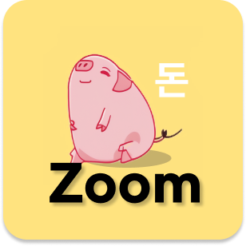

# DonZoom

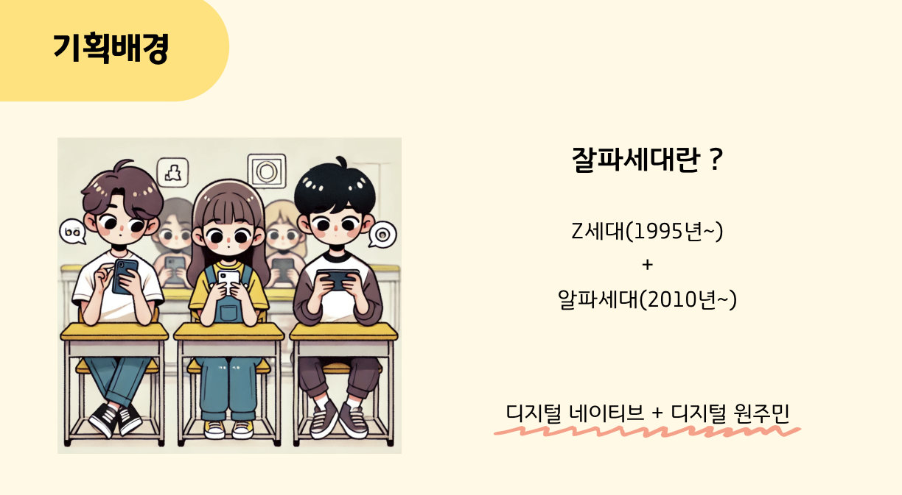
> **삼성 청년 SW 아카데미 팀 프로젝트**   **개발기간: 2024.08.19 ~ 2024.10.11**

## 개발팀 소개
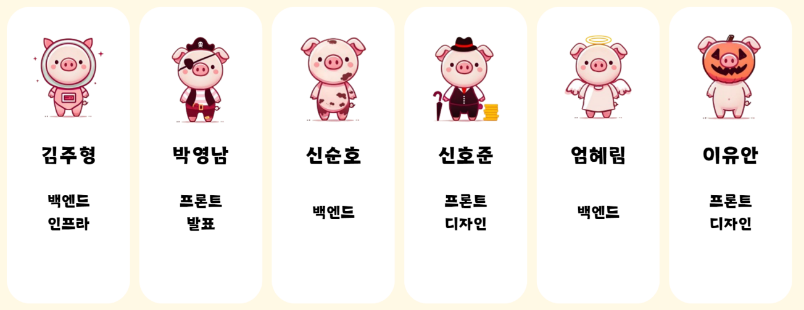

## 프로젝트 소개
- 주제: FinTech
- 프로젝트명: 돈Zoom
- 서비스 특징: 부모의 아이 용돈 관리 및 아이의 능동적인 경제 교육을 위한 어플리케이션
- 주요 기능
    - 부모의 아이 용돈 관리
    - QR코드를 통한 아이의 결제 시스템
    - 아이들의 눈높이에 맞춘 금융/경제 상식 퀴즈 시스템
    - 아이의 모의투자 시스템
    - 경제적 활동의 보상으로, 게이미피케이션을 활용한 동기부여 제공(Gotcha 시스템)

## 주요 역할

- AWS EC2 기반 Jenkins를 활용한 자동화된 CI/CD 파이프라인 구축으로 배포 프로세스 최적화
- WebSocket과 STOMP, Redis Pub/Sub 구조 활용한 실시간 주식 데이터 전송 통신 API 구현
- Redis를 활용한 데이터 캐싱을 통해 데이터 로딩 속도 개선
- Spring Security, OAuth 2.0, JWT 기반의 인증/인가 시스템 설계 및 구현으로 보안 강화
- SSL 인증서 적용을 통한 HTTPS / WSS 프로토콜 구성으로 안전한 데이터 전송 환경 구축
- 외부 금융 API 연동을 통한 고도화된 모의 투자 플랫폼 구현
- Firebase Cloud Messaging(FCM)을 활용한 실시간 모바일 알림 시스템 구축 및 통합

## 프로젝트 성과

- **삼성 청년 SW 아카데미 모바일 트랙 우수상 수상**
    - **AWS EC2 기반 Jenkins를 활용한 배포 프로세스 최적화**
        
        Jenkins를 활용해 백엔드와 프론트엔드 애플리케이션의 빌드 및 배포 과정을 자동화하여 새로운 기능이나 수정 사항을 신속하게 배포할 수 있었으며, 수작업 배포의 위험성을 줄여 안정성을 크게 향상시켰습니다.
        
        또한, 환경변수 설정을 통해 민감한 정보가 노출되지 않도록 관리하여 보안성을 강화하였습니다. 빌드 과정에서는 SonarQube를 연동하여 코드 품질을 지속적으로 모니터링하고 개선하였으며, 이를 통해 코드의 유지보수성과 성능을 높이는 데 기여했습니다.
        
    - **WebSocket과 Pub/Sub 구조를 활용한 실시간 주식 데이터 전송 통신 API 구현**
        
        실시간으로 변화하는 주식 데이터를 빠르고 안정적으로 전달하기 위해 WebSocket과 STOMP, Redis Pub/Sub 구조를 도입했습니다. 이를 통해 서버 부담을 줄이고, 동시에 수많은 클라이언트에게 실시간 데이터를 제공할 수 있었습니다. 기존 방식 대비 서버 부하를 50% 이상 줄였으며, 초당 수천 건의 실시간 데이터를 빠르게 처리할 수 있는 확장성을 확보했습니다.
        
    - **Redis를 활용한 데이터 캐싱을 통해 데이터 로딩 속도 개선**
        
        Redis 캐싱 시스템을 도입해 자주 호출되는 주식 데이터를 효율적으로 관리하고 로딩 속도를 크게 개선했습니다. 이로 인해 데이터 응답 시간이 평균 5초에서 2.4초로 단축되었으며, 트래픽 증가 시에도 안정적인 서비스 제공이 가능해졌습니다.
        
    - **Spring Security, OAuth 2.0, JWT 기반의 인증/인가 시스템 설계 및 구현으로 보안 강화**
        
        사용자 로그인과 권한 관리를 위해 Spring Security와 OAuth 2.0, JWT를 활용한 인증 및 인가 시스템을 설계 및 구현하였습니다. 이를 통해 사용자의 민감한 정보를 안전하게 보호하고, 인증 프로세스를 간소화하여 사용자 편의성을 높였습니다.
        
    - **SSL 인증서 적용을 통한 HTTPS / WSS 프로토콜 구성으로 안전한 데이터 전송 환경 구축**
        
        SSL 인증서를 적용하여 HTTPS 및 WSS 프로토콜을 구성함으로써, 클라이언트와 서버 간의 데이터 전송을 암호화하여 안전한 통신 환경을 제공했습니다. 이를 통해 네트워크 보안을 강화하고, 잠재적인 공격을 예방하여 서비스의 안정성을 높였습니다.
        
    - **외부 금융 API 연동을 통한 고도화된 모의 투자 플랫폼 구현**
        
        외부 금융 API를 연동하여 실시간 주식 시세와 관련 데이터를 불러와 모의 투자 플랫폼에 적용하였습니다. 이를 통해 사용자들이 실제와 유사한 환경에서 투자 경험을 쌓을 수 있도록 하였으며, 모의 투자 기능을 통해 사용자들의 금융 이해도를 높이는 데 기여했습니다.
        
        또한 프롬프트 커스터마이징을 통해 미성년자의 눈높이에 맞춘 관련 기사와 리포트 정보를 가공하여 제공했습니다. 그 결과 프로젝트의 본질에 맞는 서비스의 차별성을 인정받아 수상할 수 있었습니다.
        
    - **FCM을 활용한 실시간 모바일 알림 시스템 구축 및 통합**
        
        Firebase Cloud Messaging(FCM)을 활용해 사용자들에게 실시간으로 중요한 알림(예: 주식 가격 변동, 주문 체결 등)을 제공함으로써 사용자 편의성을 극대화했습니다. 이를 통해 사용자들이 앱에 지속적으로 참여하도록 유도하였으며, 기존의 SSE 방식에서 FCM을 활용한 실시간 알림 시스템을 통해 메시지 전송을 위임하여 서버의 부담 역시 감소시킬 수 있었습니다.

## 시작 가이드
### 포팅 매뉴얼
For building and running the application you need:

[포팅매뉴얼](./exec/A108_포팅매뉴얼.pdf)

## Stacks 🐈
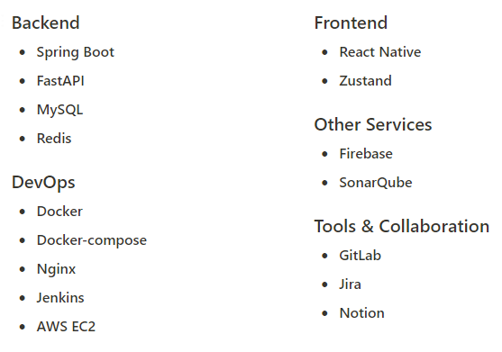

---
## 주요 기능 📦

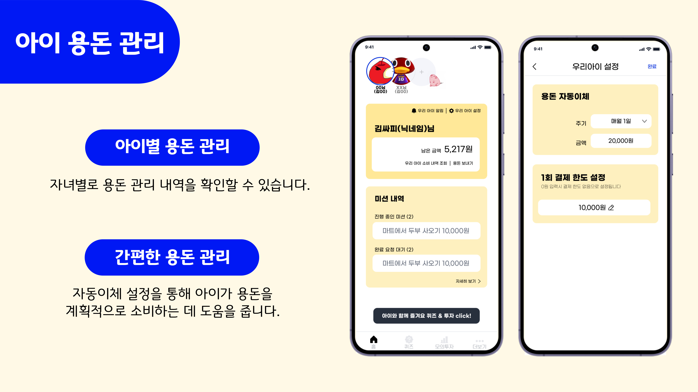
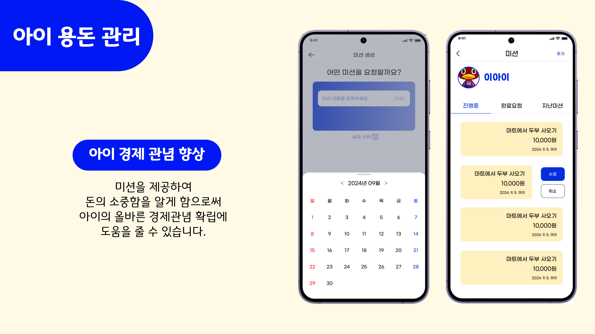
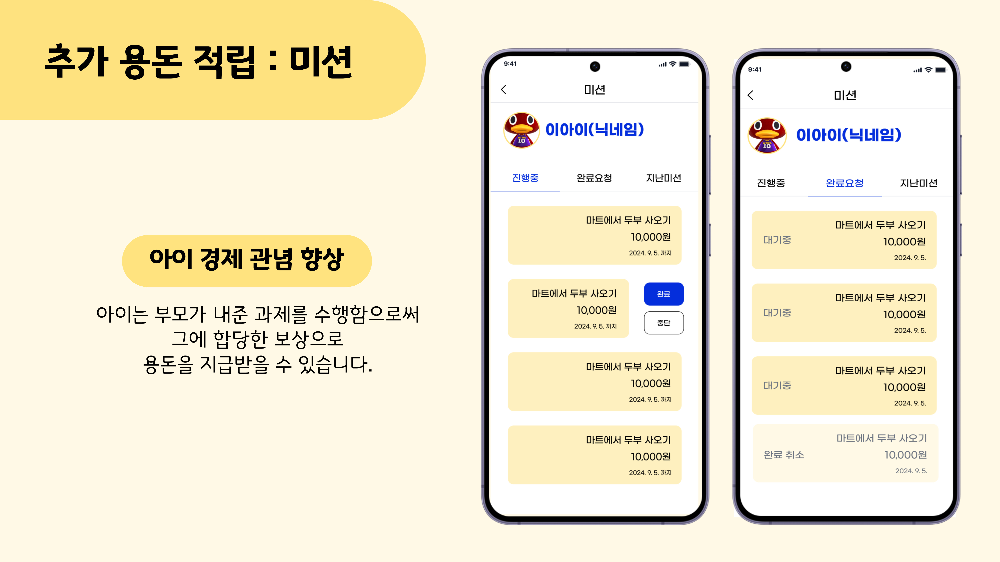
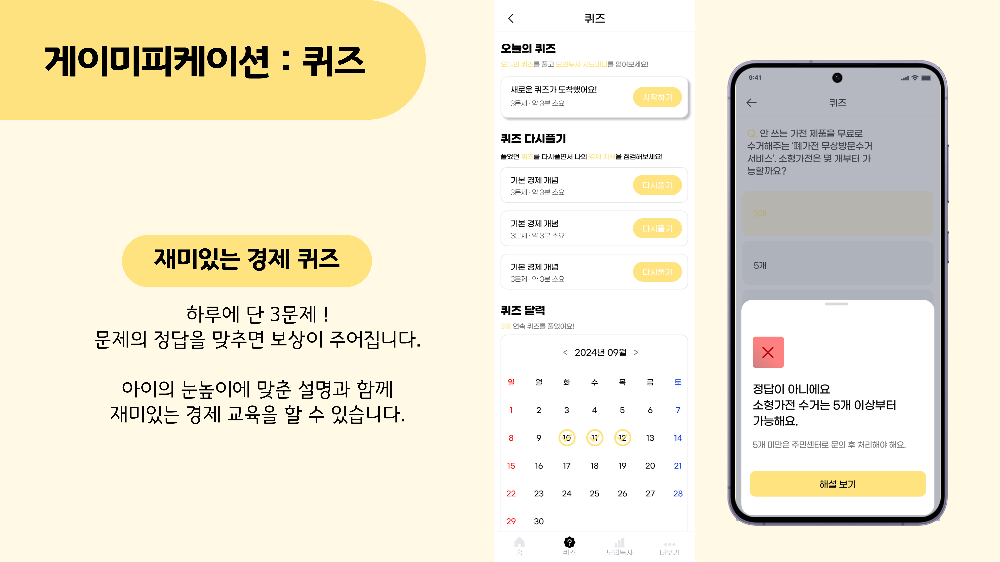
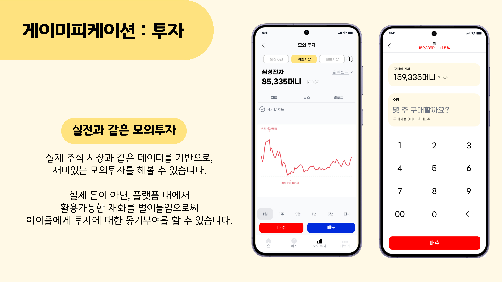
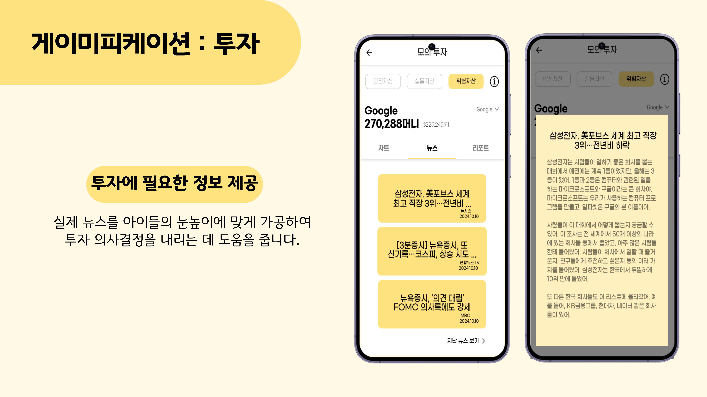
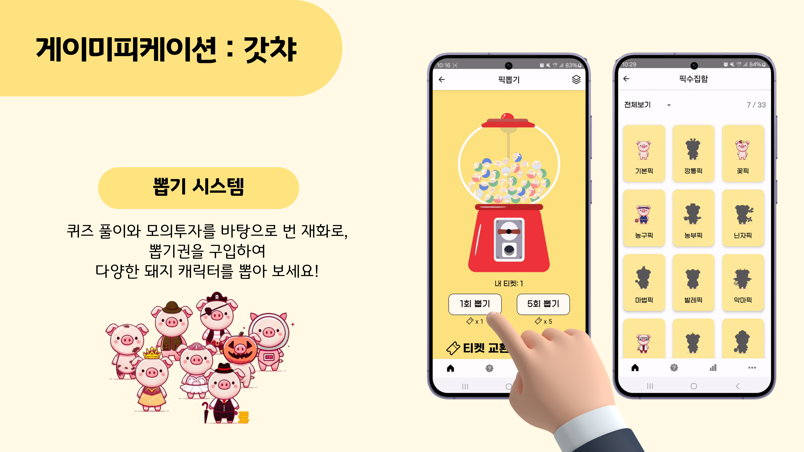

---
## 아키텍쳐

---
## ERD
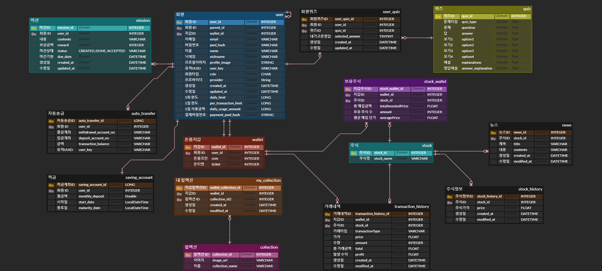
