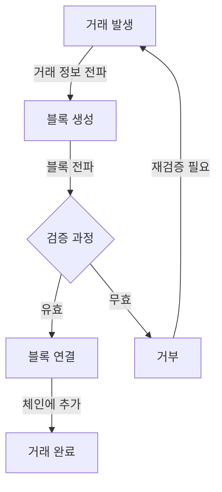

# 특화 프로젝트 Sub-1 개인과제

# 2024.08.26

학습내용

# 스마트폰 앱 종류

## 1. 네이티브 앱

**OS에 특화된 개발**
- 장점: 가장 뛰어난 성능, 많은 기능 사용 가능
- 단점: 필요한 지식이 많아 개발 속도 느림

## 2. 크로스 플랫폼

**하나의 언어로 여러 플랫폼 개발**
- 장점: 빠른 개발 가능
- 단점: 네이티브 대비 낮은 성능 및 기능 제한

## 3. 하이브리드 앱

**하나의 언어로 여러 플랫폼 개발**
- 장점: 빠른 개발 가능
- 단점: 네이티브 대비 낮은 성능 및 기능 제한

# React Native? Expo?

&rarr;

&rarr;

React Native는 Android, iOS OS에서 별도로 개발하는 어려움을 해결하기 위해, JavaScript를 사용해서 한번에 개발할 수 있도록 FaceBook에서 출시한 크로스 플랫폼 프레임워크이다.

Expo는 이런 React Native를 더욱 단순화 해서 개발하기 쉽게 만든 Tool 이다.

Native &rarr; React Native &rarr; Expo 순으로 점점 더 직관적으로 쉽게 개발할 수 있지만, 반대로 새로운 기술이 Native에서 출시된 경우 반영되는 속도가 느리다는 단점이 있다. 이에 따라 Native에서 사용가능한 기능들을 Expo에서는 사용하지 못하는 경우가 발생한다.

# 실습 내용
Expo를 사용해서 React Native 프로젝트를 생성하고, 안드로이드 환경에서 생성한 앱을 실행해보는 간단한 실습을 진행했다. 이후 기존 웹사이트를 WebView를 통해 앱 환경에서 실행시키는 실습을 진행했다. (Project Directory : React Native/test)

  
   

## 참고 링크
- [Expo](https://expo.dev/)
- [React Native](https://reactnative.dev/)
- [Expo WebView Docs](https://docs.expo.dev/versions/latest/sdk/webview/)

# 2024.08.27

학습내용

# 블록체인 기술

## 등장 배경

블록체인 기술의 등장은 2008년 글로벌 금융 위기와 밀접한 관련이 있다. 리먼브라더스 사태는 중앙화된 금융 시스템의 취약성을 드러냈고, 이에 대한 대안을 모색하는 계기가 되었다.

- **금융 위기의 영향**: 대형 금융 기관들의 붕괴와 정부의 구제 금융으로 인한 중앙화된 시스템에 대한 불신
- **사토시 나카모토의 비트코인 백서**: 2008년 10월, 사토시 나카모토의 "Bitcoin: A Peer-to-Peer Electronic Cash System" 백서에서 중앙 통제 없이 운영되는 디지털 화폐 시스템이 제안됨
- **탈중앙화에 대한 요구**: 중개자 없이 직접적이고 안전한 거래를 할 수 있는 시스템에 대한 필요성
- **데이터 무결성의 중요성**: 데이터의 투명성과 신뢰성을 보장할 수 있는 기술적 해결책 필요

## 정의

블록체인은 분산 데이터베이스를 기반으로, 거래 정보를 안전하게 저장하고 관리하는 기술

- **분산 데이터베이스**: 데이터가 네트워크의 여러 참여자들에 의해 분산 저장됨
- **체인 구조**: 각 거래 정보가 담긴 '블록'들이 시간 순서대로 연결되어 '체인'을 형성
- **암호화 기술**: Hash 암호화 방식을 사용하여 데이터의 보안과 무결성을 보장

## 주요 특징

1. **분산성**
   - P2P(Peer-to-Peer) 네트워크를 기반
   - 중앙 서버나 관리자 없이 네트워크 참여자들이 직접 시스템을 유지
   - 단일 실패 지점(Single Point of Failure)을 제거하여 시스템의 안정성 향상

2. **투명성**
   - 모든 거래 내역이 네트워크 참여자들에게 공개됨
   - 누구나 거래 내역을 확인할 수 있어 시스템의 신뢰도가 향상됨

3. **불변성**
   - 한번 기록된 데이터는 수정이나 삭제가 사실상 불가능
   - 각 블록이 이전 블록의 정보를 포함하고 있어, 하나의 블록을 수정하려면 그 이후의 모든 블록을 수정해야 하고, 이는 데이터의 무결성을 보장하고 위변조를 방지한다.

4. **보안성**
   - Hash 암호화 기술을 사용하여 데이터를 보호
   - 분산 저장 방식으로 인해 해킹이나 공격에 대한 저항력이 높다.
   - 합의 알고리즘을 통해 네트워크의 신뢰성을 유지

## 작동 과정

1. **거래 발생**: 사용자가 거래를 시작한다.
2. **블록 생성**: 거래 정보가 블록에 기록된다.
3. **검증 과정**: 네트워크 참여자들이 블록의 유효성을 검증한다.
4. **블록 연결**: 검증된 블록이 기존의 블록체인에 연결된다.
5. **거래 완료**: 블록이 체인에 추가되면 거래가 완료된다.

## 블록체인 작동 과정 다이어그램

# 2024.08.28

학습내용

# 2024.08.29

학습내용

# 2024.08.30

학습내용

