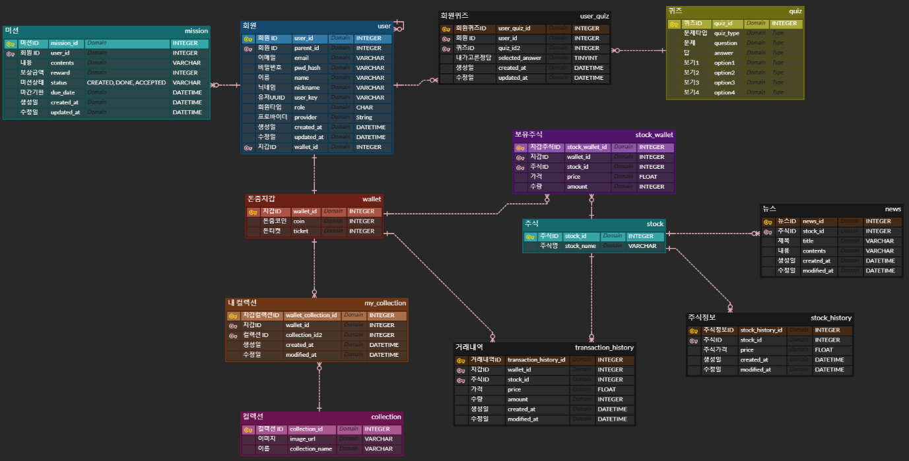
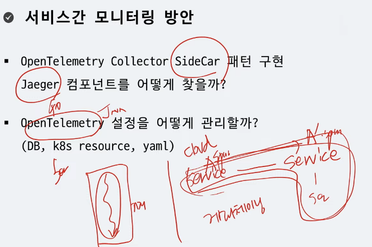

# 2024 08 26

## 기획회의

[노션링크](https://www.notion.so/240826-2a7ecdb4141d4da8a66380dba0fac903)

 - 주제1: 개인간 거래 지원 서비스
   - 주요기능: 차용증 작성 자동화
   - 추가기능(미정): 원클릭 지급명령 신청 서비스

 - 주제2: ai 음성 분석 기반 보이스피싱 예방 서비스
   - 주요기능: 음성에서 금칙어 보유여부 판단 및 통화 제한
  

## 기술 서칭

 - 리액트 네이티브 
 - (관련 강의 서칭)[https://nomadcoders.co/react-native-for-beginners]

## 팀미팅 피드백

 - 주제1
   - 개발 볼륨이 작다
   - 지인 거래에서 거래 범위를 확장하면 어떨지? ex. 소액대출서비스
   - 사회공헌적 의미를 담아도 좋을 것 

 - 주제2
   - 마찬가지로 디테일이 부족 

# 2024 08 27 

## 특화 & 블록체인 특강

## 기획회의
 - 창업 초기 투자 플랫폼 
 - 경매/부동산/주식
 - 돈관리 어플
 - 사회공헌_기부
 - 계좌이체 OCR 
 - 카페 쿠폰관리 서비스 

# 2024 08 28 

## 안드로이드 아카텍쳐 특강 

 - 앱 주요 기능:
   - 서버와의 통신 
   - 이미지 불러오기
   - 권한설정 
   - 카메라 인식 등...

 - 서버통신: Retrofit, glide, Gson
 - api의 새로운버전만 설치하면 시간절약, 유지보수 유리

  *jetpack
    -> 안드로이드에서 쓰는 라이브러리 묶음 

  안드로이드 개발자로 성장하기 위해서?
  NVVM 패턴
  Livedata
  android compose
  MVI패턴

## 기획 회의 

 - 소상공인 p2p 대출
  [관련 레퍼런스](https://blog.naver.com/fundamaster )

 - 수요자가 필요한 기능(물품) 등을 요청하고 모금하는 서비스

 - 청소년 금융교육 플랫폼

## 팀미팅 

  [피드백](https://www.notion.so/240828-81b1cb0c297f4294985395c3d605fa56)

## 주제 구체화 
 - 미성년 금육 교육 

## 깃컨벤션 작성 
  [노션 깃컨벤션](https://www.notion.so/Git-54e4e7ccd2f94680b639a36d12b9c3bd)

  
# 2024 08 29 

## 기능명세서 작성 
  [기능명세서 노션](https://www.notion.so/20790c51d64c40049d9d3c9abc6ad83d)
## 핀테크 특강

 - 인터페이스계: 서버 간의 연결 담당 
 - 

 - **코어넥스트 프로젝트** (국민은행)
 - 
 - 메인프레임(고성능,트랜젝션보장,메모리 충분)을 클라우드(리눅스 여러대)로 전환하려고 함 
 - 코볼트로 된 코드를 자바로 변환
 - 기존업무 MSA 전환 여부 

 - 거래패턴을 어떻게 구현할 것인지_거래체이닝,온라인거래,대용량처리
 - 
 - 

- 
  - ai, 클라우드, saga의 단점, msa...

 - 쿠버네티스 강의 추천 (유튜브)

## DB_ 코치세션
  충돌이 빈번할 것 같으면 **비관적 락**
  아니면 **낙관적 락**

## 피그마 목업 생성
[피그마](https://www.figma.com/design/shQgjHzjC9fsU7m0XLuqXq/A108-Mock-up?node-id=0-1&node-type=CANVAS&t=ErwrZ5C23ZEEXnxC-0)